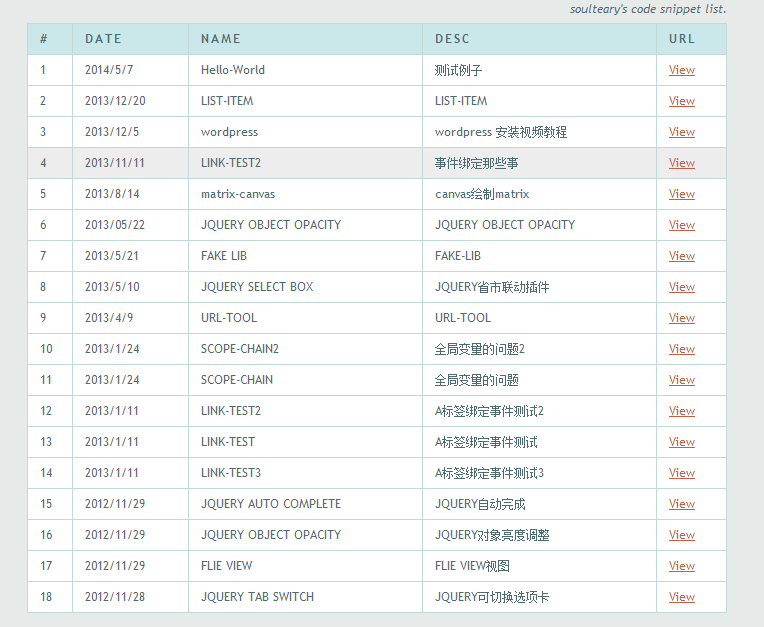
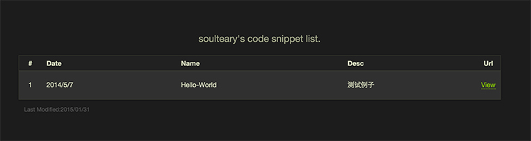

## Code Park ##

> 一个简单的代码展示工具。

### 如何使用 ###

 1. 根据自己的情况，编辑 "***index.php***" 以及 "***app.php***" 文件。
    - 请先修改 "***index.php***" 文件中的 ***Token*** 以及 "***app.php***" 文件中的 ***UriRootPath***。
 2. 上传项目文件到你的网站目录，并且将你想要展示的代码文件上传至 "/cases/年份/月份" 目录下。
 3. 刷新缓存文件，访问你的站点地址：http://yourwebsite.com/?do=update&token={{YOUR_TOKEN}}

### 演示DEMO ###

[演示例子](http://demo.soulteary.com)

### 界面截图 ###

#### 亮色主题

#### 暗色主题

---

## Code Park ##

> A Simple Code Playground

### How To Use ###

 1. Editing the "***index.php***" and "***app.php***" as you like.
    - Please change the ***Token*** in "***index.php***" and ***UriRootPath*** in "***app.php***".
 2. Uploading the whole project to your host, then upload your code case to "/cases/year/month".
 3. Flushing the page cache by visit url: http://yourwebsite.com/?do=update&token={{YOUR_TOKEN}}

### Demo ###

[Demo Site](http://demo.soulteary.com)

### Snapshot ###

#### Theme - Light

#### Theme - Dark

